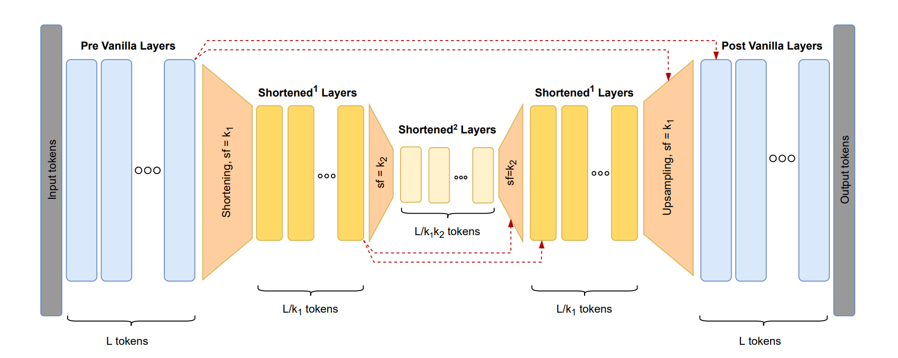

# Hourglass: Hierarchical Transformer Language Model (at character-level)

_Still working on it..._

## Introduction

Small implementation of the Hourglass from scratch. Hourglass is a Hierarchical Transformer Language Model. This auto-regressive transformer uses a U-Net-like structure, which enables it to handle longer sequences more effectively. 

My model works at a **character-level** (easier to train compared to words/sub-words). I built: pre-training, fine-tuning, and inference processes. 

The goal of this project was to gain a detailed understanding of the functioning of autoregressive transformer models through a hands-on approach and an implementation of a very interesting paper.
You can train the model yourself if you have a GPU.

The [paper](https://arxiv.org/abs/2110.13711) of reference. 

This project is partially inspired by Karpathy's GPT implementation from scratch.

 *Disclaimer*
- No pre-made tokenize.
- No already pretrained model.
- No transformers library.
- Obviously the code can be more efficient and improved.

Various datasets i used and tested:
- [Kaggle's Haiku Dataset](https://www.kaggle.com/datasets/hjhalani30/haiku-dataset)
- [Lovecraft Books](https://data.world/mattgawarecki/hp-lovecraft)
- Book Corpus (only a very small part)

## Hourglass Architecture




## Quick Example

Example of results achieved after approximately 2 hours of pre-training and fine-tuning of a ~20M parameters hourglass model.

Pre-trained
```
the rest of the women ever struck his lips , and already he was initiate of it .
he shook his head and typed away from the corner so he turned quickly , tucking down the lanes as he returned to the jar
```
Fine-tuned to generate haikus (the model generates only 3 lines and stops by itself with a EOS token)
```
an get over pay yourself
so much love to help mething is dangerous
warming dances aren't necessary
```

*Obviously the results are not the greatest, as the tokens are individual characters, my GPU/RAM isn't the best and I only trained the model for a couple of hours.*

## Install

```
git clone https://github.com/MaxLSB/hourglass-hierarchical-transformer.git
```
```
pip install -r requirements.txt
```

## Training 

To train the model using you own dataset, use the ```pretrain.py``` file with argparse commands.

Example of a training command:
```
python pretrain.py --factors 2 1 1 2 4 4 --data_path your/data/file.txt --block_size 500 --n_heads 8 --learning_rate 3e-4
```
_(In the correct folder)_

| Argument | Type | Default | Description |
|----------|------|---------|-------------|
| `--factors` | list of int | [3, 1, 8, 4] | List of tuples defining the hourglass structure. Format is [top_layers, top_factor, bottom_layers, bottom_factor]. [3, 1, 8, 4] creates a structure with 3 layers at factor 1, 8 layers at factor 4, and 3 more layers at factor 1. The corresponding hierarchie in the paper would be 3@1 8@4 3@1  |
| `--batch_size` | int | 64 | Batch size for training. |
| `--block_size` | int | 256 | Block size for training. |
| `--n_heads` | int | 6 | Number of attention heads. |
| `--n_embedding` | int | 512 | Embedding dimension. |
| `--dropout` | float | 0.2 | Dropout rate. |
| `--epochs` | int | 10 | Number of epochs for training. |
| `--iter` | int | 1000 | Number of batches per epoch. |
| `--eval_iter` | int | 200 | Number of batches per validation. |
| `--learning_rate` | float | 4e-4 | Learning rate for training. |
| `--betas` | list of float | [0.9, 0.98] | Beta parameters for Adam optimizer. |
| `--eps` | float | 1e-9 | Epsilon parameter for Adam optimizer. |
| `--train_val_split` | float | 0.90 | Ratio of training and validation data. |
| `--data_path` | str | 'data/path' | Path to the data file. |
| `--model_save_path` | str | 'model/save/path' | Path to save the model. |
| `--vocab_path` | str | 'vocab/path' | Path to save the vocabulary. |


## Finetuning

To finetune your pretrained model for haikus generation, use the ```finetune.py``` file with argparse commands.

**Note:** The fine-tuning only allows the model to generate three-line haikus from scratch and to stop generating immediately after.
I still need to work on the 'prompt' finetuning process.

## Inference

To perform inference with your trained model, use the ```inference.py``` file with argparse commands.

| Argument | Type | Default | Description |
|----------|------|---------|-------------|
| `--gen_mode` | str | "scratch" | Type of generation to perform. Choose from "prompt" or "scratch". |
| `--max_tokens` | int | 250 | Maximum number of tokens to generate. |
| `--load_model_path` | str | 'load/model/path.pth' | Path to load a trained model for inference. |
| `--vocab_path` | str | 'vocab.json' | Path to the vocabulary file. |

## To Do
- Add the perplexity
- Cleaning some parts of the code
- Xavier Init ?
- Proper Argparsing for the ```finetune.py``` file
- Try to pre-train and fine-tune the model for a longer period
